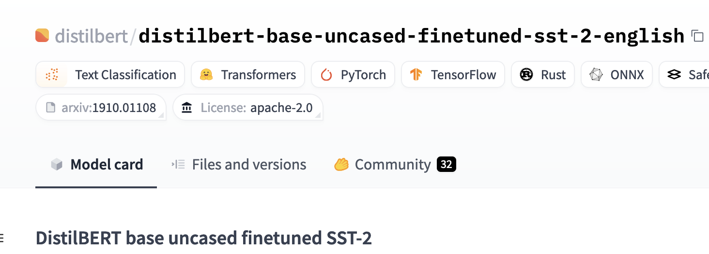

# LLM Project

## Project Task
To develop a sentiment analysis tool that uses a Large Language Model to interpret emotions in text data from the IMDB movie review platform.

## Dataset
Large Movie Review Dataset from Huggingface.co. This is a dataset for binary sentiment classification containing substantially more data than previous benchmark datasets. They provided a set of 25,000 highly polar movie reviews for training, and 25,000 for testing. 

## Base Model
Using the Large Movie Review Dataset it came with a classification label column that labeled the movie review as positive or negative. Using a Random Forest Classifier I calculated an accuracy of the model of 0.85.

## Pre-trained Model
From Hugginface.co I chose the "distilbert-base-uncased-finetuned-sst-2-english" model and "sentiment-analysis" task. The results can be found at the **pre-trained-model.ipynb** notebook.

After removing all the punction, making the string lower case, removing the stop words and truncating the string to 512 characters (BERT model would only accept max 512) the dataset movie review strings were fed into the BERT model pipeline to get the sentiment, postive/negative and the accuracy for the individual move reviews.

## Performance Metrics
I have chosen the metric **ACCURACY** to evaluate my models performance during optimization to be consistent with the pre-trained model in the prior task. During the initial training I had the following training arguments:

```
training_args = TrainingArguments(
    output_dir="my_model",
    learning_rate=2e-5,
    per_device_train_batch_size=16,
    per_device_eval_batch_size=16,
    num_train_epochs=1,
    push_to_hub=False,
)
```

The model had an accuracy of 0.92746. Although within the range of acceptable parameters the lower end of the range was chosen given the computational load on my laptop. The above training and evaluation took 35 minutes on a MacBook Pro (Apple M3 Pro 32 GB) November 2023. There was also a lot of trial and error with given error messages that prolonged the evaluation time.

## Hyperparameters
I decided to change the learning rates, batch size and training epochs in my hyper-tuning.

```
training_args = TrainingArguments(
    output_dir="../data/optimized_model",
    learning_rate=1e-5,
    per_device_train_batch_size=32,
    per_device_eval_batch_size=32,
    num_train_epochs=3,
    push_to_hub=True
)
```

1. Learning rate - A smaller learning rate means the model will learn more slowly but can converge more smoothly
2. Batch_size - A batch size of 32 means 32 samples will be processed together before updating the model parameters during training.
3. num_train_epochs - 3 epochs, the model will go through the whole training dataset three times.

These hyperparatmers are more computational intensive and require more memory. The training and evaluaton time took 1.5 hours on my MacBook Pro. The model accuracy with the revised training arguments is 0.92756, which is slighlty better than the previous settings that had an accuracy of 0.92746.

## Relevant Links

    Model: https://huggingface.co/distilbert/distilbert-base-uncased-finetuned-sst-2-english



    Dataset: https://huggingface.co/lvwerra/distilbert-imdb

    My Hugging Face Repo: https://huggingface.co/kenwallmisc/optimized_model